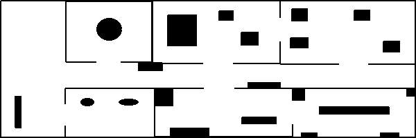

# Simple Scan Matcher (ROS+Python)

Point-to-point scan matcher without any help from odometry sources. The method is implemented super-simple so it doesn't work well, and it may not work well in your cases. Use only for educational purposes. You can also check [the notebook](https://salihmarangoz.github.io/blog/2D-Scan-Matcher/) on my website for this experiment.

Youtube Link: https://youtu.be/t-31ekrpjxk

[](https://youtu.be/t-31ekrpjxk)

The original map for the recorded bag: (Bag is generated using https://github.com/salihmarangoz/robot_laser_simulator)



## Features

- ROS (inputs `/scan`)
- Publishes the matching error between `odom` to `laser` transforms.
- Efficient point-to-point matching with KD Tree.
- Old scan is only updated if the robot moves or rotates above a certain threshold.
- Demo bag is available.

## Running

```bash
# Demo with bag:
$ roslaunch basic_scan_matcher start.launch
```

